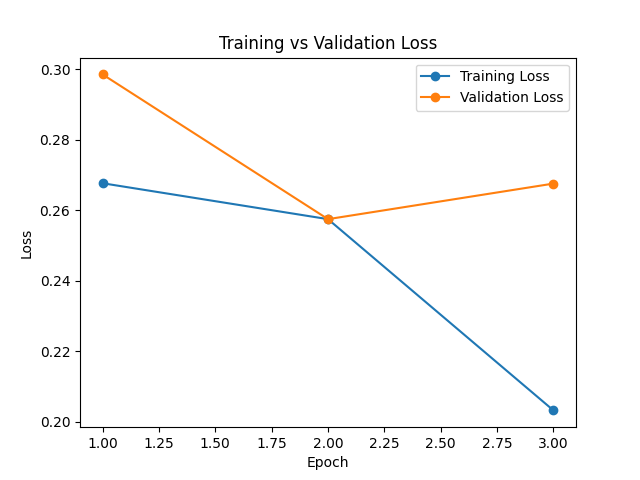

# IMDb Movie Review Sentiment Classification with DistilBERT + LoRA

This study fine-tunes the DistilBERT model with LoRA (Low-Rank Adaptation) to classify IMDb movie reviews as positive (1) or negative (0). The training was performed on Google Colab using a T4 GPU.

## Project Overview

Model: DistilBERT (distilbert-base-uncased)
Adaptation: LoRA (r=8, alpha=16, dropout=0.3)
Dataset: Stanford IMDb (50,000 labeled movie reviews)
Task: Binary classification (Positive / Negative)
Platform: Google Colab, T4 GPU

The goal is to achieve good classification performance efficiently, without training a large model from scratch, by using LoRA for lightweight fine-tuning.

## Requirements

transformers: For model and tokenizer
datasets: For the IMDb dataset
peft: For LoRA
accelerate: For training optimization
matplotlib: For VRAM usage plotting
scikit-learn: For computing accuracy

## LoRA Hyperparameters 

Rank (r) = 8
LoRA alpha = 16
LoRA dropout = 0.3

## Training

Training is done for 3 epochs, batch size 8, using half precision (fp16).

## Results 

Test Accuracy = % 90.34
Duration of Training = 10.06s 

| Epoch | Training Loss | Validation Loss |
|-------|---------------|----------------|
| 1     | 0.2677        | 0.2986         |
| 2     | 0.2575        | 0.2575         |
| 3     | 0.2032        | 0.2676         |

You can also visualize the training and validation loss over epochs in the graph below:

